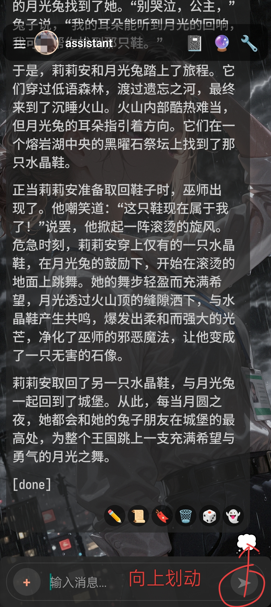

*该功目前只是辅助，无法替代总结。建议配合世界书和状态栏使用，将重要事件和细节手动添加到世界书。*

# 如何使用记忆和知识库功能

## 1.申请嵌入式模型的API

建议使用硅基流动（siliconflow）和Gemini的API，因为它们是免费的。

Gemini：在ai.dev申请免费的API key.
如果你已经有Gemini的llm API，则不需要再次申请，可直接使用llm的API。

硅基流动：直接在以下网址注册，然后生成API key，记录下你的key即可。
https://account.siliconflow.cn/

因网络延迟等原因，亚洲地区用户建议使用硅基流动，欧美地区用户可以使用Gemini。Gemini的嵌入式模型体感稍慢。

## 2.配置嵌入式模型API

点击右上角🔧按钮，点击记忆和知识库，进入如下设置界面。

先点击供应商名称，选择你使用的供应商，然后填入你的key。
硅基流动请按上图配置模型和参数（请关闭发送维度参数的开关）。是否启用重排序，根据你的使用体验来决定。开了也不一定更好。

Gemini则请直接使用默认值（模型使用gemini-embedding-001,维度填写3072，发送维度参数开启）

填好后点击保存。然后可以在下方测试区域添加文本进行测试。

## 3.启用记忆和知识库

开启启用记忆和知识库，然后到相应的标签页打开启用角色记忆、启用知识库的开关。

建议知识库使用全局设置。在下方世界书管理中可以将世界书导入到知识库。点击需要启用的条目的开关将其启用，然后点击生成向量并保存。

## 4.启用和管理角色记忆

如图所示，在输入区域（建议在发送按钮处）上划，即可将角色记忆按钮💭划出。点击💭进入角色记忆管理。
初次使用肯定是没有记忆内容的，首先切换到配置页面，将记忆提取正则、记忆提示词、记忆使用提示词配置好。不知道怎么填写，可以直接点击“使用默认”来使用默认值。

*示例正则：`/<\s*gen_memory\s*>([\s\S]*?)<\/\s*gen_memory\s*>(?![\s\S]*<\s*gen_memory)/i`*

如果之前你导入并启用了知识库，在下方开启为此角色使用知识库的开关以及对应的知识库。
最后点击最上方的保存按钮。

现在返回聊天，llm模型便会根据你填写的记忆提示词的要求为你生成每轮对话的记忆。后续聊天中，角色便可以“回忆”起这些记忆内容。当然，这取决于记忆的质量和嵌入模型的能力（

## 5.其它建议

配合一些预设的总结功能，以及隐藏楼层功能和全局正则，可以实现无限聊天（大概）

例如，当楼层很高时，让AI总结上文，然后隐藏大部分旧的楼层，保留总结，然后继续对话。当聊天轮次再次变得很多时，重复以上步骤。

细节则可以自己在总结中手动添加（使用消息编辑按钮），或者维护一本世界书。

本次更新也同步更新了`/hide`和`/unhide`两个ST的斜杠命令，使用方法和傻酒馆基本一致，输入/hide 楼层数 即可隐藏对应楼层，例如/hide 0表示隐藏最开始的消息；/hide 0-20 表示隐藏0-20楼的消息，隐藏的消息不会发送给LLM。
隐藏后，消息会显示一个幽灵👻的emoji。/unhide则为取消隐藏。

也可以使用上图的全局正则来实现自动隐藏历史楼层。可以下载以下正则导入使用。

[上下文限制[10].json](./images/help/Embedding/上下文限制[10].json)
[上下文视觉屏蔽[20].json](./images/help/Embedding/上下文视觉屏蔽[20].json)
