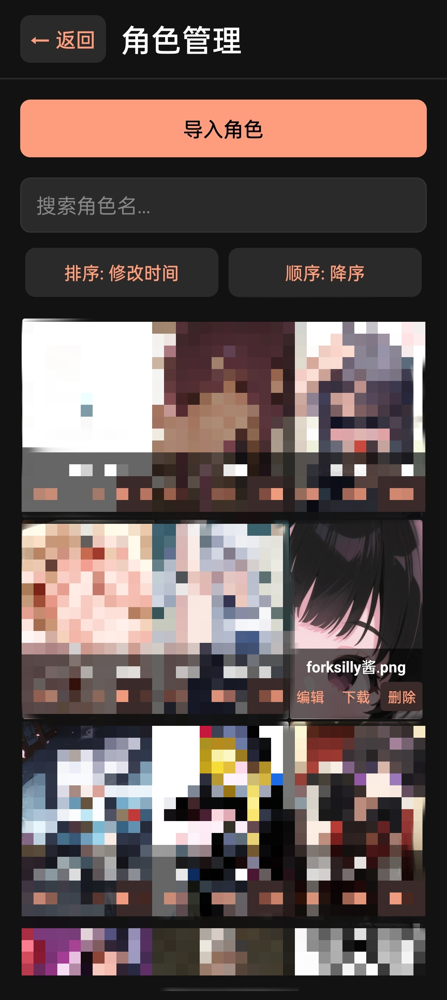
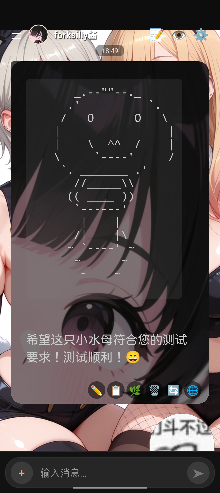

# forksilly.doc
*一个react native/expo项目，主要用于Android。理论上也可以打包成ipa；适用于对sillytavern有一定使用经验的用户*

此仓库存放ForkSilly的文档和源码，使用前请先阅读[注意事项](#注意事项)


<details>
  <summary>查看预览</summary>

</details>

* **该项目为自用分享，不接受任何功能申请或答疑，使用上有问题请先参考本文档，如果无法解决或让你感到体验不好，可以去使用sillytavern项目或其它酒馆类似物，也可以自行修改代码**
  * *99.9%的代码由AI生成，你提需求我也做不出来（*
* **修改和分发请注意遵守Licence**
* **适合纯文字卡、简单插图卡（使用图床），不适合花里胡哨的前端卡**
+ 兼容sillytavern V2角色卡（png）、世界书、正则、预设
  - 暂不支持新建角色，请通过导入空角色卡的方式创建角色
+ 支持更换任意字体，将字体文件下载到你的手机然后在应用中选择即可
+ 支持更换聊天背景图片（需使用链接，如图床或直接使用网络图片）
+ 请使用OpenAI兼容格式API，Gemini专用格式有可能以后会支持（建议通过轮询项目转为OpenAI兼容格式）
- 不支持快速回复（包括快速回复脚本）
- 不支持tts(语音)
- 不支持连接nai等AI生图服务

## License

This project is licensed under the GNU Affero General Public License v3.0 (AGPL-3.0).  
See the [LICENSE](./LICENSE) file for details.

## 打包命令

源码以zip格式上传。
如果你想自己打包APK，可使用以下命令（需先配置Android开发环境和Java开发环境）：
```
npx expo prebuild --platform android --clean
npx expo run:android（模拟器调试）
gradlew assembleRelease（切换到Android目录执行）
```

## 注意事项

- **安装：部分品牌手机自带的文件管理器可能会阻止你安装未授权的应用或直接弹出安装失败，如果遇到这种问题，请使用mt管理器或其它第三方文件管理器安装（<span style="background-color: black; color: black;">https://mt2.cn</span>
）**
- API设置、主题设置中的文本输入框修改数值后，需点击虚拟键盘上的确认键（回车键的位置），或点击一下其它输入框，然后点击保存才能生效
- **在角色编辑界面修改了角色信息后，需重新在角色管理界面选择角色进入聊天，若直接返回聊天，当前角色的信息仍是旧的；角色管理界面默认按修改时间排序，编辑角色后，请下拉刷新以便让其显示到最前方**
  * 请不要多次点击保存，这会丢失你之前编辑的内容！
- **预设、世界书、正则等导入时，如果无法导入，请不要在文件选择器的“最近”等地方选择，请点击弹出的选择器（你手机系统自带的文件管理）侧边栏的`文件管理`或“你的手机名称”的项目，从设备目录中选择要导入的文件**
  * 通常，Discord中下载的文件会保存在“download”目录，QQ下载并手动保存的文件（注意保存到手机后才能看到！只在QQ里点击下载是看不到的！）通常在`download/QQ`目录下
  * 如果仍有问题，建议安装mt管理器，导入时从侧边栏选择mt管理器的图标用mt管理器选择文件导入
- 如果预设文件名太长，会挡住保存按钮。请点击另存为，输入一个较短的文件名。
- 聊天界面右上角的⚙️图标、消息气泡右下角的🌐图标、聊天历史中的✏️图标暂时没有添加功能，请不要点击
- 卡片主题要滑动整个消息列表，需滑动AI消息气泡外的区域（例如屏幕边缘或上下空白处），滑动消息部分仅能滚动消息本身的内容。
- **如果你发现看不到AI回复的消息或消息不完整，请点击编辑按钮或检查你的预设，将自定义标签添加到主题与样式设置中的自定义标签中（例如`<content>、<statusblock>、<status>、<statusbar>`等，添加时不要填写尖括号`<>`），选择渲染为原始内容即可**
- 如果消息超出了消息气泡、代码块中文本显示不全，请到主题设置中调整聊天气泡高度和代码块高度。默认主题的设置也会影响卡片主题。
- 角色的首条消息会将`{{user}}`和`{{char}}`等占位符直接显示出来，这是特性不是bug（仅显示，发送给AI的请求仍会替换为相应的名字。如果不信可以点击右上角的预览提示词查看）
* 请在用户管理中添加你的自设（必须选择头像，否则无法保存）

*以上注意事项均是特性，不是bug;不要问能不能改，请阅读本文档第一条的内容*

## 使用技巧

支持部分HTML和markdown语法，例如：
```
文字颜色：
<font color='red'>①这是红色字。</font>
<span style="color: black;">这是黑的文字</span>
插入网络图片：


...
```

支持roll和random占位符，例如
- {{roll:10000}}
- {{roll:1d100}}

支持常见占位符，包括{{user}}、{{char}}、{{lastcharmessage}}、{{lastusermessage}}、{{lastmessage}}，因此大多数预设无需修改可直接使用
