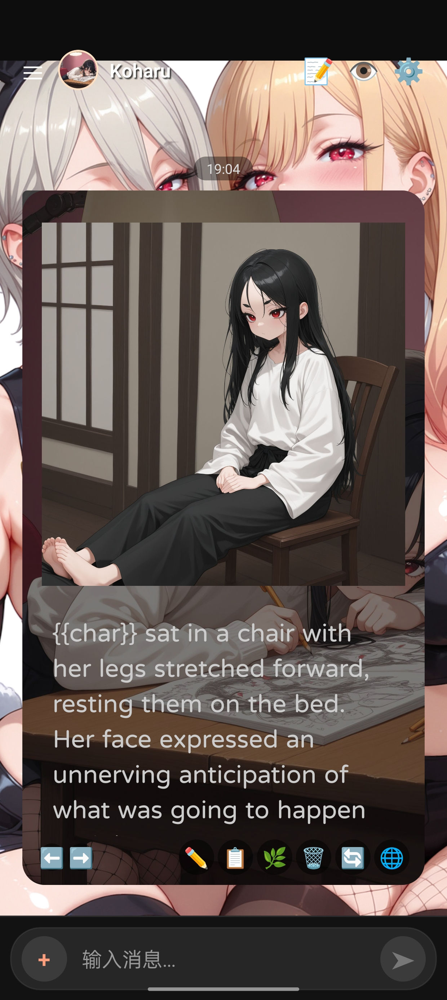

<details>
  <summary>最近更新</summary>

version test1.25
  
* 支持Gemini的OpenAI兼容接口的连接
* 添加了聊天中点击左上角角色头像切换角色的功能：点击后角色会像气泡一样被吹出来  <br>
* 添加了收藏功能，在角色管理中收藏角色后，切换角色时将优先吹出收藏夹中的角色气泡<br>
* 更新了流式传输时的动画效果；优化一些组件的弹出动画<br>

</details>

# forksilly.doc
此仓库主要存放ForkSilly的文档，
顺带发布ForkSilly的apk安装包和源码（仓库文件仅文档，不含源码，源码上传于[📦releases](https://github.com/fatsnk/forksilly.doc/releases/latest)），使用前请先阅读[注意事项](#注意事项)

## 概要
ForkSilly: *一个react native/expo项目，主要用于Android。理论上也可以打包成ipa；适用于对sillytavern有一定使用经验的用户*</br> ~~*中文名*：*“傻叉”*（~~
<p><em>手机上用sillytavern很麻烦，别的类似项目又或多或少表现得和ST不一样（不是说不好，其它项目的功能非常丰富，很好玩，只是不适合我），于是干脆让AI写了一个</em></p>


<details>
  <summary>查看预览</summary>

</details>

## ForkSilly介绍
* **该项目为自用分享，无法受理任何功能申请或答疑，使用上有问题请先参考本文档，如果无法解决或让你感到体验不好，可以去使用sillytavern项目或其它酒馆类似物，也可以自行修改代码**
  * *因为99.9%的代码由AI生成，你提需求我也做不出来😭（*
* **适合纯文字卡、简单插图卡（使用图床或[本地上传](#使用技巧)），以及Stable Diffusion文生图。不适合花里胡哨的前端卡**
+ 兼容sillytavern V2角色卡（png）、世界书、正则、预设
  - 暂不支持新建角色，请通过导入空角色卡的方式创建角色，或者使用[角色卡编辑器](#推荐工具)
+ 支持更换任意字体，将字体文件下载到你的手机然后在应用中选择即可
+ 支持更换聊天背景图片（使用外链，如使用图床或使用网络图片）
+ 可导出或重新导入聊天记录、新增/编辑/导出角色世界书/正则、管理/启用禁用多个全局世界书/正则、支持编辑/新增/导入导出全局世界书和正则脚本
+ 聊天时快速开关预设条目
+ 可用OpenAI兼容格式API，以及Gemini的OpenAI兼容接口，支持Google AI studio的API key，提示词后处理选严格。（Gemini专用格式不支持，建议通过轮询项目或自建中转/反代转为OpenAI兼容格式）
+ 通过存储管理，用户可以导出应用内的所有内容，并可自行删除缓存（请谨慎操作）
+ 支持Stable Diffusion文生图功能(sd需开启监听：添加启动参数` --api --listen --cors-allow-origins '*'`)，请点击⚙️图标进入更多选项-文生图，并添加API、预设并设置默认和参数，然后在触发标签中开启聊天文生图功能。预设中的main在请求时会被替换成捕获的提示词，其它条目则会根据你选择的位置拼接。
  * 在llm的预设中添加一个文生图条目，让AI输出你自定义的标签包裹的文生图提示词即可，例如`<gen_image>prompt tags</gen_image>`。流式开启时有时候可能无法触发，可点击🖼手动生成。
  * 可在存储管理的gallery目录中找到聊天中生成的图片
- 不支持快速回复和快速回复脚本
- 不支持tts(语音)
- 不支持连接nai

## License

ForkSilly包含第三方依赖，查看它们的许可详情：[LICENSE-THIRD-PARTY](./LICENSE-THIRD-PARTY) 

This project is licensed under the GNU Affero General Public License v3.0 (AGPL-3.0).  
See the [LICENSE](./LICENSE) file for details.

## 打包

源码以zip格式上传于release。
项目结构：[项目结构文档](ProjectStructure.md)

如果你想自己打包APK，可下载源码到本地，使用以下命令调试和打包（需先配置Android开发环境和Java开发环境）：
```
npx expo prebuild --platform android --clean
npx expo run:android（在模拟器调试）
gradlew assembleRelease（切换到Android目录打包）
```

## 注意事项

- **安装：部分品牌手机自带的文件管理器可能会阻止你安装未授权的应用或直接弹出安装失败，如果遇到这种问题，请使用[mt管理器](https://mt2.cn)或其它第三方文件管理器安装
）**
- API设置、主题设置中的文本输入框修改数值或文本后，需点击虚拟键盘上的确认键（回车键的位置），或点击一下其它输入框，然后点击保存才能生效
- **在角色编辑界面修改了角色信息后，需重新在角色管理界面选择角色进入聊天，若直接返回聊天，当前角色的信息仍是旧的**
- **预设、世界书、正则等导入时，如果无法导入，请不要在文件选择器的“最近”等地方选择，请点击弹出的选择器（你手机系统自带的文件管理）侧边栏的`文件管理`或“你的手机名称”的项目，又或者选择第三方文件管理，从设备目录中选择要导入的文件；也可以尝试在存储管理中导入预设**
  * 通常，Discord中下载的文件会保存在“download”目录，QQ下载并手动保存的文件（注意保存到手机后才能看到！只在QQ里点击下载是看不到的！）通常在`download/QQ`目录下
  * 如果仍有问题，建议安装mt管理器，导入时从侧边栏选择mt管理器的图标用mt管理器选择文件导入
- 如果预设文件名太长，会挡住保存按钮。请点击另存为，输入一个较短的文件名。
- 默认主题消息气泡右下角的🌐图标无实际作用，请不要点击；卡片主题下，点击此按钮可以显示一些带美化HTML的角色卡的美化效果。
- 卡片主题要滑动整个消息列表，需滑动AI消息气泡外的区域（例如屏幕边缘或上下空白处），滑动消息部分仅能滚动消息本身的内容。
- **如果你发现看不到AI回复的消息或消息不完整，请点击编辑按钮或检查你的预设，将自定义标签添加到主题与样式设置中的自定义标签中（例如`<content>、<statusblock>、<status>、<statusbar>`等，添加时不要填写尖括号`<>`），选择渲染为原始内容即可**
- 如果消息超出了消息气泡、代码块中文本显示不全，请到主题设置中调整聊天气泡高度和代码块高度。默认主题的设置也会影响卡片主题。
- 角色的**首条消息**会将原始占位符例如`{{user}}`和`{{char}}`等直接显示出来，这是特性不是bug（仅显示，发送给AI的请求仍会替换为相应的名字。可以点击右上角的预览提示词查看确认）；强制替换：点击✏️编辑消息，然后直接点击保存，占位符会被替换为实际的内容，替换后不可逆；也可使用正则处理显示。
- 目前API参数中的最大上下文窗口是无效的，如果因楼层太高上下文太长导致你使用的模型返回错误，请使用消息框右下角的删除或分支功能减少几楼，然后总结重开。
- 聊天输入框可能会被手机屏幕底部的手势辅助线顶起。只能通过关闭手势辅助线（小白条）解决。
- 不要启用空正则，角色会爆炸（
* 在用户管理（YOU）中可以添加你的自设（必须选择头像，否则无法保存）

*以上注意事项均是特性，不是bug;不要问能不能改，请阅读[ForkSilly介绍](#ForkSilly介绍)第一条的内容* （

## 下载

<p align="left">
  <a href="https://github.com/fatsnk/forksilly.doc/releases/latest">
    
  </a>
</p>

## 兼容性指引

本项目在同类项目中不是最好看的，但一定是最兼容sillytavern的（
* 角色卡、预设：forksilly ⇌ sillytavern 可直接在相应的界面导出，并直接在sillytavern中使用，反之亦然；所有内容均与st中的对应。（角色备注会被忽略；“提示词覆盖”设置中的主要提示词`main`如果不为空，会替换掉预设中main条目的内容，jailbreak/post-history instructions的内容则始终使用预设中的内容，角色卡中的对应内容会被忽略；不支持变量占位符）
* 全局世界书、全局正则：forksilly ⇌ sillytavern 同上，所有参数和实际表现均与st相同。部分sillytavern的高级参数可能不适用，但不影响互相导入。
* 角色世界书：随角色卡一起导入，导出角色时也会包含在角色卡中。可单独导出角色世界书，并可直接导入到sillytavern。不能直接在forksilly应用中将额外的世界书文件导入到角色信息中，只能编辑、添加条目。如需将单独的世界书附加到角色卡，请使用[OcO萌/AI角色卡编辑器：CharacterEditor](https://ce.ooc.moe/zh-CN)，或直接在sillytavern中操作。
* 角色正则：支持编辑、新增，不支持直接将正则脚本文件导入到角色卡；请使用复制粘贴的方式，或使用上面提到的角色卡编辑器。
* 聊天记录：如果要导出记录给st使用，请前往存储管理-chats目录=角色名目录-长按选择需要导出的记录，点击左下方的“转换”按钮，会生成一个包含‘_converted’字样的新聊天记录，该记录导出后可直接导入到st。st的记录也需在存储管理中转换后才可在forksilly中使用，否则消息顺序是反的。
- 关于角色备注、作者注释、世界书位置中的作者注释前/后：这些功能均被世界书的功能完全覆盖，因此本应用不再支持这些设置参数，会忽略它们。

## 使用技巧

支持部分HTML和markdown语法，例如：
```
文字颜色：
<font color='red'>①这是红色字。</font>
<span style="color: black;">这是黑的文字</span>
插入web图片：


使用在存储管理中上传的图片：

...
```

支持roll和random占位符，例如
- {{roll:10000}}
- {{roll:1d100}}

更多占位符请查阅[项目结构文档](ProjectStructure.md)

支持常见占位符，包括{{user}}、{{char}}、{{lastcharmessage}}、{{lastusermessage}}、{{lastmessage}}，因此大多数预设无需修改可直接使用

支持http和https形式的API baseurl 连接你的AI和Stable Diffusion<br>
想使用不受信任的https连接或frp内网穿透？请参考：[服务器自签证书教程](服务器自签证书教程.md)

在⚙️中的存储管理中可管理你的文件，并可在`Gallery/角色名`目录下导入表情包和角色图片，以支持让AI以HTML格式插入聊天中，使用相对路径，例如``
角色管理界面点击排序后默认按修改时间排序，编辑角色后，可下拉刷新以便让其显示到最前方；将角色添加到收藏，可以让ta优先显示

### 推荐工具

角色卡创建和编辑：[OcO萌/AI角色卡编辑器：CharacterEditor](https://ce.ooc.moe/zh-CN)

文生图webui推荐（[stable-diffusion-webui-forge](https://github.com/lllyasviel/stable-diffusion-webui-forge)）：ControlNet的开发者lllyasviel制作的优化版webui，对性能较差的显卡有很大提升
  * 秋葉aaaki的整合包（[B站链接](https://www.bilibili.com/video/BV1rc6nYNEYo)）：支持SD3.5、FLUX，解压即用，无须安装git、Python、cuda等任何内容，只需将模型放入Stable Diffusion目录，在启动器高级设置中启用远程连接，即可使用！非常适合不想进行复杂设置、折腾ComfyUI工作流的玩家

文生图模型推荐：[WAI-NSFW-illustrious-SDXL](https://civitai.com/models/827184?modelVersionId=1761560)

[new-api](https://github.com/QuantumNous/new-api)：AI接口管理与分发系统，支持将多种大语言模型转为统一的OpenAI兼容格式调用，有Windows版本，双击即可使用，方便管理和使用不同供应商的API。
