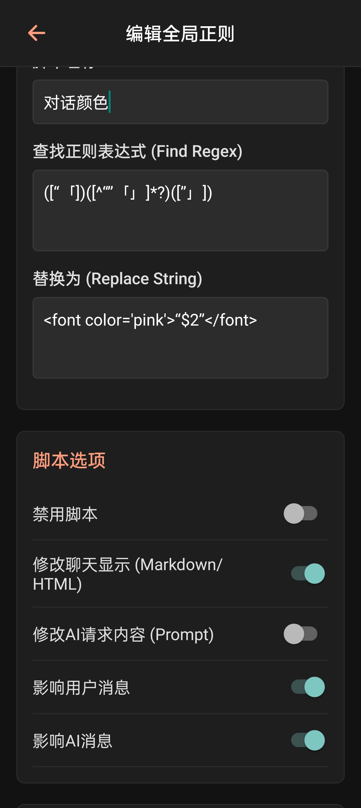

# 新手帮助文档：

第一次接触AIRP，不知道什么是kobold、sillytavern的玩家，参考下面的简单使用介绍。*ST的老用户可以直接跳到[进阶设置](#文生图)*

```
此项目适合：

1.想在手机上随时游玩；
2.想游玩开源角色卡，与角色们对话；
3.想节省tokens，但又想与AI进行超长对话；
4.希望角色拥有记忆；
5.希望尽量减少API的请求，以节省费用；
6.想在聊天中使用Stable Diffusion生成图片；
7.喜欢纯文字卡；
8.不想安装sillytavern、折腾各种插件；
9.希望尽量兼容酒馆的配置；

或者单纯觉得sillytavern傻酒馆在移动设备上的游玩体验不好，
你都可以试试本应用。

本项目不支持tts语音和前端变量角色卡（即需要酒馆助手插件、提示词模板插件、表格插件等第三方插件的角色卡）

应用的优点：
所有数据保存在本地，且内置了存储管理，可以导出应用中的资料。
支持导入导出sillytavern的角色、预设、世界书、正则、聊天记录。
直观的角色编辑以及方便的角色管理；通过收藏功能可以方便地让喜欢的角色位于最前排。
支持导入本地ttf字体文件、更换聊天背景、更改气泡颜色、字体颜色、字体大小、透明度等各种样式设置。

核心理念：

坚持轻量、快速的聊天和角色扮演体验，以及实惠、性价比高的API使用方式：
应用启动迅速，避免搭建在vps上的云酒馆服务令人烦躁的载入；
不使用mcp等需要多次请求API的技术，每次发送消息只请求一次llm API，保证回复速度，并减少不必要的额度消耗，同时避免了传统的使用额外的API请求进行剧情总结经常失败的问题；
支持接入Google提供的gemini免费llm模型用于聊天、谷歌和硅基流动siliconflow提供的免费嵌入式模型用于向量生成和记忆、知识库检索，可以连接Stable Diffusion进行文生图，通过以上搭配能实现0付费的、图文并茂的、带记忆生成和检索的聊天体验。
```

---

## 🎬 新手快速上手指南

### 1. 打开app & 创建 Persona

* 假设你已经安装好ForkSilly并正常开启应用。
* 此时界面应该非常简洁。直接点击左上角≡弹出侧边菜单，点击“you”，输入你自己的用户设定，然后选择头像并保存。聊天时，该设定会告诉AI你是谁。

---

### 2. 配置 API 连接

* 点击侧边菜单中的 **API设置** 。
* 两种常见方式：

  **A. 使用免费模型**

  * 可以前往gemini官网[ai.dev](https://ai.dev)，申请免费的api key。获取key后，在API设置选择gemini类型，填写你的key，然后点击测试连接。最推荐的提供商之一，但有一定的使用门槛，例如需要解决网络问题和预设。
  * 免费服务[Pollinations.AI](https://pollinations.ai/)：开源平台，官方称提供简单易用的文本和图像生成API，无需注册或API密钥，保障用户隐私。选择OpenAI兼容类型，填写URL为`https://text.pollinations.ai/openai`，密钥填写一个空格即可。未注册用户也可以使用部分模型。要使用更多模型，前往[验证页面](https://auth.pollinations.ai/)连接你的GitHub账号并生成密钥。可用模型有gemini flash lite和openai的低端模型等，应该勉强可以游玩[chub](https://chub.ai/)上的开源角色卡。 *可能有严格的审核，并且对话内容可能会在pollinations上展示*
    * Pollinations同时提供免费的[文生图服务](https://github.com/fatsnk/forksilly.doc/blob/main/text2img.md#%E5%85%8D%E8%B4%B9%E6%9C%8D%E5%8A%A1pollinations)。
  * ollama：ollmam.com，著名开源项目。在官网注册并生成密钥。每周有少量免费额度，提供glm等开源模型，能较好地体验中文角色卡。唯一问题是免费额度很少。
  * NVIDIA NIM APIs：前往官网注册老黄账号。似乎每天有额度不明的免费额度，提供deepseek等开源模型试用；主要问题是高峰期会很卡，模型也非满血。API端点为`https://integrate.api.nvidia.com/v1`
  * 其它送免费额度的提供商，在 "API设置" 选择 OpenAI兼容类型，粘贴 Key 并点击“测试连接”验证连接是否有效。

  **B. 使用付费模型**

  可以使用OpenAI兼容格式的URL。例如：
  * ChatGPT：在 [OpenAI 官网](https://platform.openai.com)生成 API Key。
  * deepseek：[在deepseek官网](https://platform.deepseek.com/sign_in) 获取API key, 并使用官方的API url: `https://api.deepseek.com/v1`
  * 在 "API设置" 选择 OpenAI兼容类型，粘贴 api Key到“API密钥” 并点击“测试连接”验证连接是否有效。

* 配置完毕后，点击“保存设置”关闭设置窗口。<br>
*2025年11月推荐模型：gemini 3.0 pro(目前是收费模型)、glm4.6(ollama上可以免费使用)、Claude 4.5 opus（降价了）;备选：Gemini 2.5 pro、deepseek V3.1/3.2、Claude 4.5 sonnet*

---

### 3. 获取角色（Character）

* 前往你知道的地方获取角色卡，比如Discord社区，或者直接在Google搜索`sillytavern Character card`，第一页会有几个分享角色卡的网站，前往下载png格式的角色卡。

* 点击侧边菜单的 **角色列表** 。
* 导入你下载或创建的png角色卡。
    * 或者自行创建角色：在角色管理界面点击新建角色按钮，从零开始创建自己的角色；也可以选择从JSON文件创建角色。

---

### 4. 设置预设

* 点击侧边菜单的 **预设列表** 。
* 点击“新建预设”，点击启用。
* 虽然默认设置足够入门，但如果你了解提示词（prompt）设计，可以在这里配置详细的上下文。
* 你可以使用别人分享的sillytavern预设来更好地指导AI如何进行输出；通常，你可以在sillytavern和角色卡相关的社区中找到网友分享的预设。

---

### 5. 发起对话

* 点击侧边菜单的 **角色列表** 。
* 选择一个角色，会自动导航到聊天屏幕。
* 在底部输入框输入你想说的话，然后点击发送。

---

## （进阶设置）

### 文生图

应用支持连接Stable Diffusion进行文生图。

文生图配置教程：[文生图简单教程](text2img.md)

### 记忆和知识库

记忆和知识库使用教程：[记忆和知识库教程](Embedding.md)

### 世界书、预设提示词

* 提示词（prompt）或者说上下文、api请求，指用户发送消息时，提交给AI的内容。无论你使用的前端设计得多复杂、功能多丰富，本质都是对提示词进行处理、编排，这里面没有任何的魔法。理解了上下文的本质，你就能更好地与AI玩耍。

* 预设：这里指llm模型的提示词预设，通常由按顺序排列的一组提示词条目组成。除了来自角色卡的部分，其它部分都由预设制作者或你自己自定义，用于指导AI如何回复。所有提示词内容都可以是自然语言，所以你应该自己学会写提示词。
  
在你点击发送按钮时，预设中启用的所有条目均会发送给AI（不仅仅是你在聊天界面看到的消息）。

默认预设具有类似以下的结构：

|条目名称|提示词说明|作用|
|:----|:----|:----|
|main prompt|顶部的提示词，可以直接修改，如果角色卡的高级设置中有填写，则会使用角色卡中填写的内容。部分预设不使用这个内容。|普通的提示词，并没有特殊性，你可以自行填写、修改、关闭或移动到其它位置。|
|world info before|注入位置为“角色定义前”的世界书条目的提示词插入的位置|通常为世界观设定|
|persona description|你的用户提示词，在“YOU”中填写。|你自己的人设，用于告诉AI“用户是谁，用户扮演什么角色”|
|char description|角色描述。在角色卡中填写|通常是主要角色的人物设定|
|char personality|角色个性，在角色卡中填写| |
|scenario|场景，在角色卡的“场景设定”中填写| |
|world info after|注入位置为“角色定义后”的世界书条目的提示词插入的位置|世界观或角色的细节，NPC信息，地点，或者数值属性、装备，写作风格、格式要求等，看创作者心情|
|chat examples|消息示例，在角色卡中填写|通常不需要也不建议填写|
|chat history|消息列表，即你在聊天界面看到的所有消息。|这是你和角色的对话内容（当前聊天的上下文），不应该关闭|
|post-history instructions|在消息内容后发送的内容（你没看错，在你回复的消息后面，仍可以插入其它提示词），通常用于解除模型的输出限制|部分预设作者会关掉这个条目，使用新建的条目来填写相关提示词。在forksilly中，该条目没有特殊性。|

条目的位置并不固定，制作者可以移动、调整、重命名、禁用、移除条目。除以上条目外，用户还可以新建条目，插入到列表中的任意位置。

世界书（world book或lorebook）：按照某种设定好的触发规则，自动插入到上下文中的提示词。这里主要解释一下“按聊天深度插入”。
深度指插入到聊天中的哪个位置，深度0指最新消息：

*消息列表，对应预设中的“chat history”：*

```
……（更多历史消息）
AI消息（倒数第五条消息）
└─深度5，以此类推
用户消息（倒数第四条消息）
└─深度4
AI消息（倒数第三条消息）
└─深度3
用户消息（倒数第二条消息）
└─这里是深度2
AI消息（聊天界面最后一条消息，通常是你看到的最后一条AI回复）
└─这里是深度1
你还未发送的消息
└─这里是深度0
```

**显然，如果世界书有深度为0的条目，则此类条目对AI的优先级比你最后发送的消息还要高，如果条目的要求与你的回复冲突，AI很可能不理会你的输入。游玩其他人的角色卡时，请注意检查深度0的世界书条目是否符合你的需求。**

*此概念与正则脚本中的作用深度类似。*

### 正则脚本

* 示例1：修改对话内容（中文引号包裹的内容）的文字颜色：



如图，使用正则`([“「])([^“”「」]*?)([”」])`匹配中文引号及其包裹的内容，然后替换成你喜欢的颜色，例如`<font color='pink'>“$2”</font>`。根据你的需求可以改成其它颜色值。

---

### 有用的提示词

#### 生成选项

```
<下一步选项>
# 在每次输出的最末尾，提供数个符合当前情境的选项供玩家作为下一步行动的参考。
选项要有足够区分度。

## 选项输出格式示例（样式非必要。应根据情况使用合适的颜色和emoji）：

请选择您的下一步行动：

<button style="background: #3b82f6; color: white;">① 选项1</button>
<button style="background: pink; color: white;">②  选项2</button>
<button style="background: red; color: yellow;">③ 选项3</button>
...（根据需要可以输出更多选项）
（也可以输出<button disabled">被禁用的按钮</button>表示当前不能选择的行动。）

</下一步选项>

```
AI输出渲染效果参考：


可以点击选项将其复制到剪贴板。
