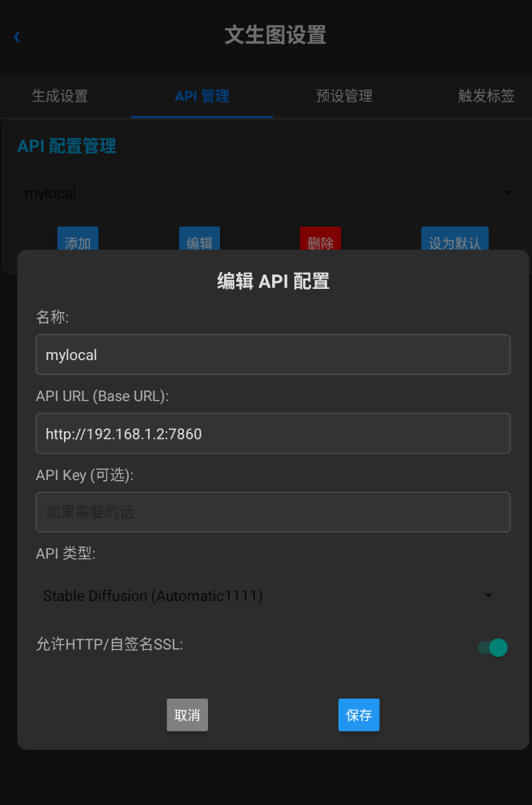
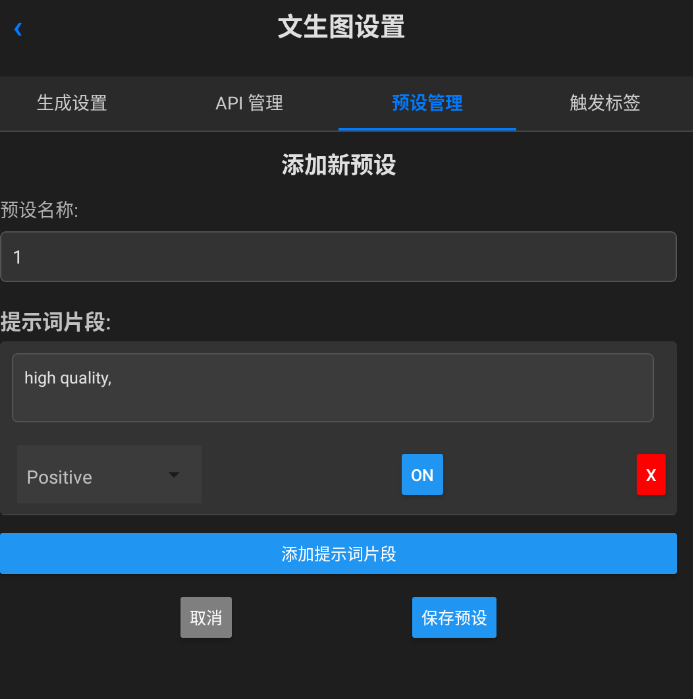
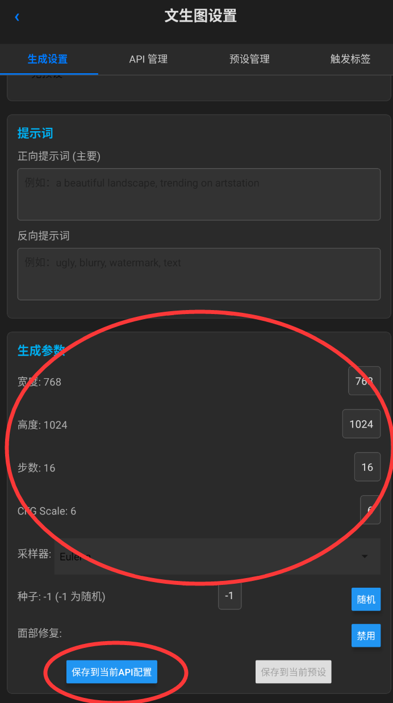
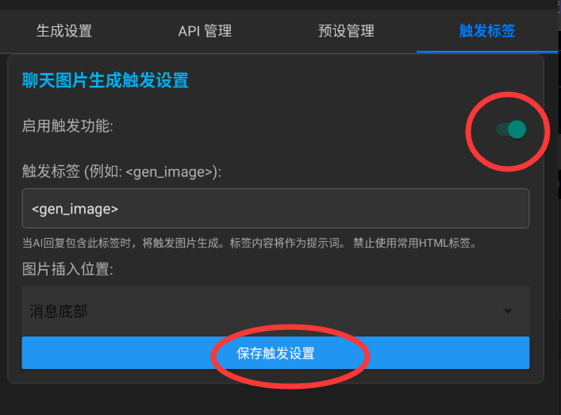
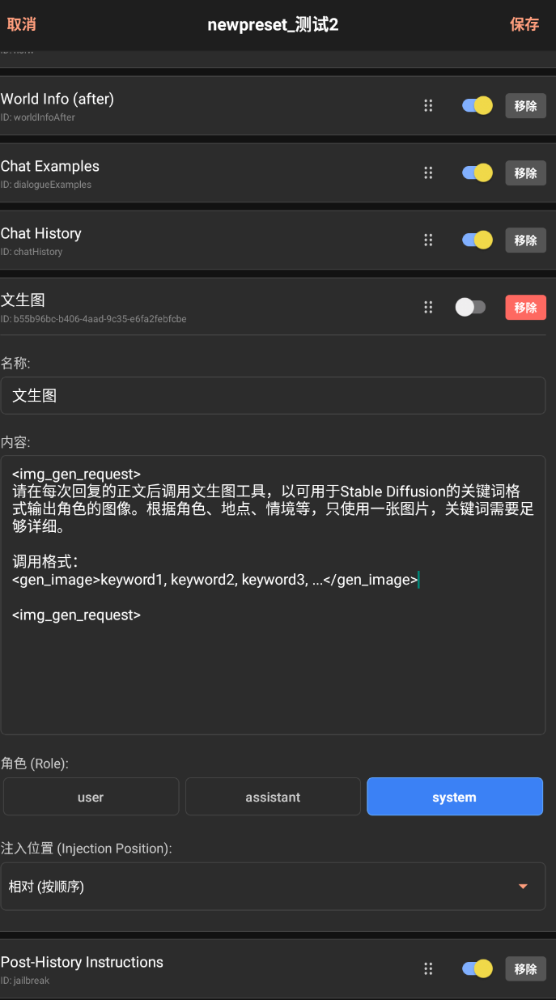
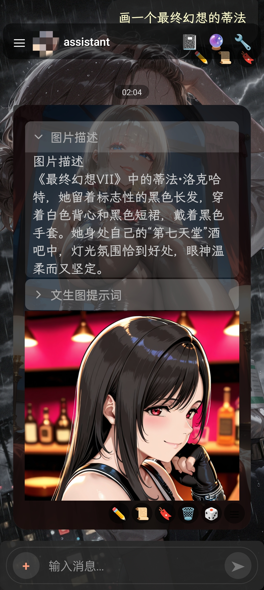
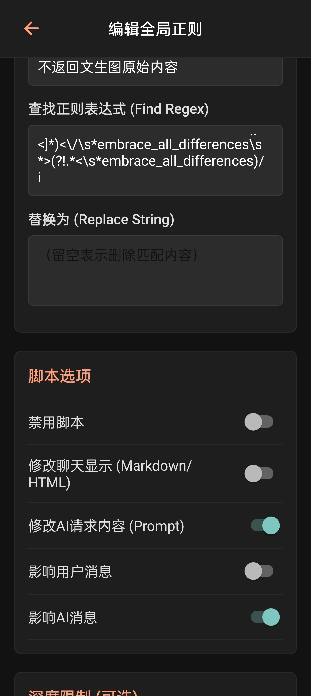
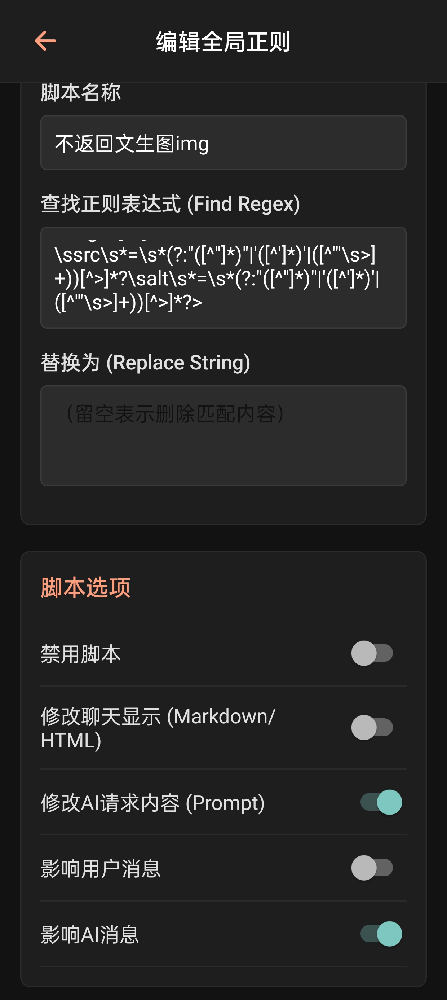

# 文生图简单教程

## 免费服务Pollinations

[Pollinations.AI](https://pollinations.ai/)：开源平台，官方称提供简单易用的文本和图像生成API，每天有一定免费额度。

打开forksilly，点击右上角🔧，选择文生图，进入文生图设置。
切换到`API管理`标签页，选择API类型为“Pollinations”，获取模型名称（flux或turbo等，现在有大香蕉、seedream、Zimage等新模型，可以点击get models查看）并保存，点击设为默认按钮。

前往[管理页面](https://enter.pollinations.ai/) 登录你的GitHub账号，并生成API密钥，填写到文生图的APi设置中。

然后前往预设管理页面随便添加一个预设保存并设为默认。

接下来，切换到生成设置标签页，填写你喜欢的参数，然后点击下方的保存到预设。
注意参数以API中保存的为准，所以建议先点击保存到当前预设，然后再点击保存到当前API设置，这里的模型（model）也会覆盖API管理中的设置。

*（Zimage性价比最高。turbo模型似乎对非正方形比例支持较好，flux有时会拉伸图像；其余模型消耗积分很多，一天用不了几次，请自行检查官方的priceing。Pollinations的图像有缓存，因此重新生成是不会改变图片的，需要手动修改种子。）*

在聊天中启用文生图，请阅读后续的[通用设置](#通用设置)

**建议添加一个对AI隐藏img标签的正则，** 防止AI后续生成不存在的img标签内容：[正则设置](#可选设置) 

## Stable Diffusion

1.部署Stable Diffusion并打开监听端口，建议使用（[stable-diffusion-webui-forge](https://github.com/lllyasviel/stable-diffusion-webui-forge)），下载秋葉aaaki的整合包（[B站链接](https://www.bilibili.com/video/BV1rc6nYNEYo)），请参考相关教程，这里不再过多介绍。*暂不支持填写API key,请勿设置密码*

2.打开forksilly，点击右上角🔧，选择文生图，进入文生图设置。
点击`API管理`标签，添加你部署好的Stable Diffusion的地址并保存：



3.点击`预设管理`标签，添加一个预设，随意填写一些预定义的提示词，例如high quality，点击保存：



4.点击“生成设置”，选择刚才保存的API配置，然后在下方的生成参数中填写你的模型使用的参数，并点击“保存到当前API配置”。点击保存按钮后，界面参数可能会恢复原始值，返回重新进入该设置界面即可。你也可以在这里测试图片生成是否正常：



## 通用设置

5.点击`触发标签`选项卡，打开“启用触发功能”开关，然后点击保存。你也可以自行填写喜欢的触发标签，不修改则默认是"gen_image".



6.在llm的预设或世界书中新增条目，填写文生图提示词，指导AI使用正确格式输出关键词，例如：

```
<img_gen_request>
请在每次回复的正文后调用文生图工具，以可用于Stable Diffusion的关键词格式输出。根据角色、地点、情境等，只使用一张图片，关键词需要足够详细。

调用格式：
<gen_image>keyword1, keyword2, keyword3, ...</gen_image>

<img_gen_request>

```

将`<gen_image>`改成你自己设置的触发标签。



7.到这里已经设置完毕。如果在第四点生成设置中测试能正常生成图片，则已经可以正常使用。

参考效果图：



## 可选设置

隐藏生成图片的img标签和原始文生图标签，避免影响AI回复，节省tokens。
在全局正则中添加以下两个正则：

`/<\s*gen_image\s*>([^<]*)<\/\s*gen_image\s*>(?!.*<\s*gen_image)/i`

gen_image改成你自定义的触发标签。最小深度可以设置为3，为AI保留前一个回复的触发标签。

`]*?\ssrc\s*=\s*(?:"([^"]*)"|'([^']*)'|([^'"\s>]+))[^>]*?\salt\s*=\s*(?:"([^"]*)"|'([^']*)'|([^'"\s>]+))[^>]*?>`

删除所有img标签，避免AI学习。注意不要打开修改聊天显示的开关，否则自己也看不到图片了。



9.公网使用

使用frp工具将sd服务暴露到公网，或者使用zerotier等内网穿透工具将你的手机和电脑连接到同一局域网。
