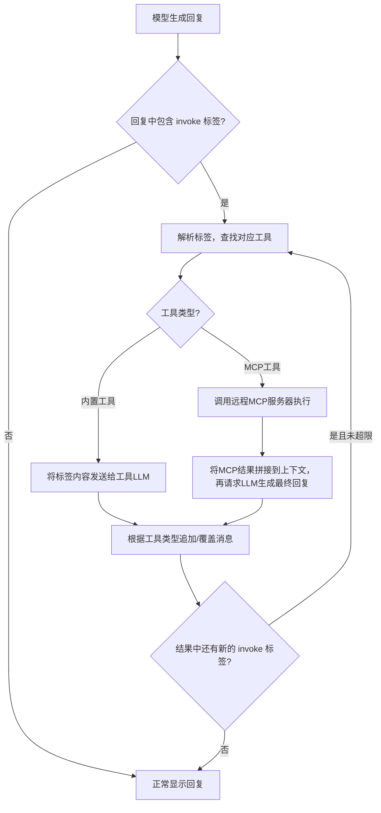
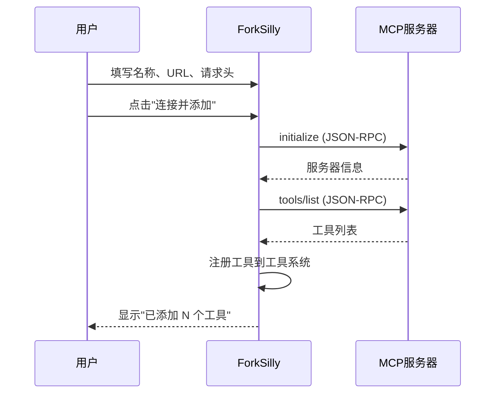

已阅读完所有相关代码。以下是面向用户的使用说明文档：

---

## ForkSilly 工具与 MCP 使用说明

### 一、概述

ForkSilly 的工具系统允许 AI 模型在生成回复时调用额外的能力——包括内置的文本处理工具和远程 MCP（Model Context Protocol）服务。工具通过特殊的 XML 标签触发，模型在回复中输出这些标签后，应用会自动识别并执行对应操作。

整体流程如下：



---

### 二、进入工具设置

在应用右上角的🔧更多选项菜单中找到「工具」入口，进入后可以看到三个区域：

1. 全局设置
2. 远程 MCP 服务
3. 工具列表

---

### 三、全局设置

| 设置项 | 说明 |
|---|---|
| 最大调用链次数 | 单条消息中工具可递归调用的上限（1~20）。当工具LLM的返回结果中又包含新的 invoke 标签时，会继续执行，直到达到此上限。批量调用（invoke-batch）内部不会递归。 |

---

### 四、内置工具

应用预置了两个文本处理工具：

#### 4.1 内容追加（content.append）

- 功能：将工具 LLM 返回的内容追加到当前消息末尾
- 调用格式：
  ```xml
  <invoke name="content.append">
  请根据以下内容生成一段评论：{{thisMessage}}
  </invoke>
  ```
- 标签内的全部文本会作为用户消息发送给工具 LLM，返回结果拼接到原消息后面

#### 4.2 内容改写（content.rewrite）

- 功能：用工具 LLM 返回的内容覆盖当前消息的完整文本
- 调用格式：
  ```xml
  <invoke name="content.rewrite">
  请将以下内容润色为更优美的文学风格：{{thisMessage}}
  </invoke>
  ```
- 返回结果会直接替换整条消息

#### 4.3 `{{thisMessage}}` 宏

在内置工具的标签内容中，可以使用 `{{thisMessage}}` 宏。它会被替换为当前消息去除所有 invoke 标签后的干净文本，方便你引用原始内容。

#### 4.4 如何让模型知道怎么调用？

在工具列表中展开内置工具的详细设置，点击「📖 使用说明」按钮，可以查看并复制该工具的调用说明文本。将这段文本粘贴到你的 Prompt 预设、角色卡、世界书等上下文管理位置中，模型就能了解如何使用该工具。

---

### 五、远程 MCP 服务

MCP（Model Context Protocol）允许你连接外部工具服务器，让模型获得搜索、数据查询等扩展能力。

#### 5.1 添加 MCP 服务器

1. 在「远程 MCP 服务」区域点击「+ 添加」
2. 填写以下信息：
   - 服务名称：自定义名称，如 `Tavily`
   - 服务器 URL：MCP 服务器的 Streamable HTTP 端点地址
   - 自定义请求头（可选）：JSON 格式，用于认证等场景，例如 `{"Authorization": "Bearer your-api-key"}`
3. 点击「连接并添加」，应用会自动：
   - 向服务器发送初始化请求
   - 获取该服务器提供的所有工具列表
   - 将这些工具注册到工具系统中



#### 5.2 管理已添加的服务器

每个已添加的 MCP 服务器卡片上显示：
- 服务名称和端点 URL
- 工具数量和上次连接时间
- 🔄 刷新：重新连接服务器并更新工具列表
- 🗑 删除：移除该服务器及其所有关联工具

#### 5.3 MCP 工具的调用方式

MCP 工具在工具列表中以 🌐 图标标识，名称格式为 `服务名/工具名`（如 `Tavily/tavily_search`）。

模型通过以下格式调用：
```xml
<invoke name="Tavily/tavily_search">
{"query": "最新的AI新闻"}
</invoke>
```

标签内容应为 JSON 格式的参数。如果不是有效 JSON，会被自动包装为 `{"input": "原始文本"}`。

#### 5.4 MCP 工具的执行流程

1. 应用解析 invoke 标签，提取工具名和 JSON 参数
2. 通过 JSON-RPC 调用远程 MCP 服务器的 `tools/call` 方法
3. 获取工具执行结果
4. 将结果拼接到完整对话上下文中，再发送给 LLM 生成最终回复
5. 根据「结果处理模式」将最终回复追加到消息末尾或覆盖整条消息

#### 5.5 查看工具参数

展开 MCP 工具的详细设置，点击「📋 查看参数 (inputSchema)」可以查看该工具接受的 JSON 参数结构定义，方便你在 Prompt 中告知模型正确的调用格式。

---

### 六、工具的详细设置

展开任意工具卡片，可以配置以下选项：

| 设置项 | 适用范围 | 说明 |
|---|---|---|
| 启用开关 | 全部 | 只有启用的工具才会被识别和执行 |
| API 配置 | 全部 | 工具 LLM 使用的 API 配置。留空则使用主聊天配置 |
| 模型 | 全部 | 覆盖 API 配置中的默认模型。可以为工具指定更便宜/更快的模型 |
| 系统提示词 | 仅内置工具 | 引导工具 LLM 理解任务的系统级指令 |
| 处理后移除调用标签 | 全部 | 开启后，工具执行完毕会从消息中移除 invoke 标签 |
| 结果处理模式 | 仅 MCP 工具 | 「追加到消息末尾」或「覆盖整条消息」 |

---

### 七、批量调用

当需要在一条消息中同时调用多个工具时，使用 `invoke-batch` 标签包裹：

```xml
<invoke-batch>
  <invoke name="content.append">补充一段分析...</invoke>
  <invoke name="Tavily/tavily_search">{"query": "相关数据"}</invoke>
</invoke-batch>
```

批量调用中的工具会按顺序依次执行，但批量调用整体不会触发递归（即结果中的新 invoke 标签不会被继续处理）。

---

### 八、常见问题

Q：工具没有被触发？
- 确认工具已在设置中启用
- 确认 invoke 标签格式正确，`name` 属性值与工具列表中的 ID 完全一致
- 确认模型确实在回复中输出了 invoke 标签（需要在 Prompt 中告知模型调用格式）

Q：MCP 服务器连接失败？
- 检查 URL 是否正确，必须是 Streamable HTTP 协议的端点
- 如果服务器需要认证，确认请求头格式正确（必须是 JSON 对象）
- 检查网络连接是否正常

Q：工具调用后消息内容异常？
- 检查「结果处理模式」设置是否符合预期
- 检查「处理后移除调用标签」是否开启
- 调低「最大调用链次数」避免意外的递归调用
